## Для кого может быть полезно

Общая рекомендация остаётся прежней: разрабатывать на своём компьютере/ноутбуке, установив на него все необходимые инструменты, и использовать RubyMine либо VS Code в качестве редактора кода. Однако, если у вас нет достаточно мощного компьютера, или вам хочется часто работать из компьютерных классов, можете воспользоваться этим гайдом по созданию проекта на Replit и подключению к нему GitHub.

## Шаг 1. Создаем проект

1. На стартовой странице replit нажимаем `+ Create Repl`

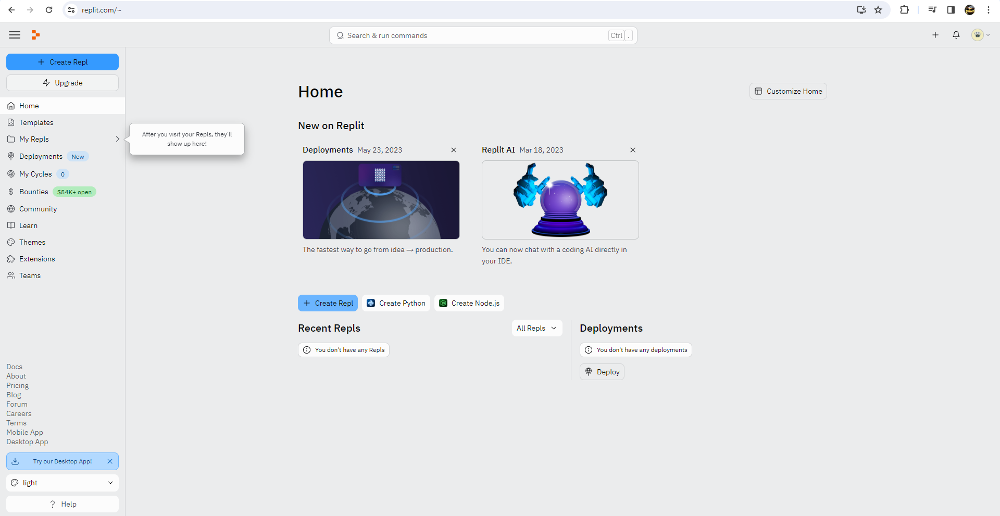

2. Во всплывающем окне набираем rails и выбираем первый шаблон

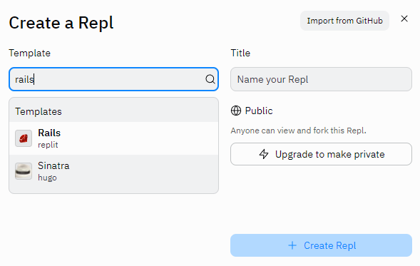

3. Вписываем название проекта и нажимаем `+ Create Repl`

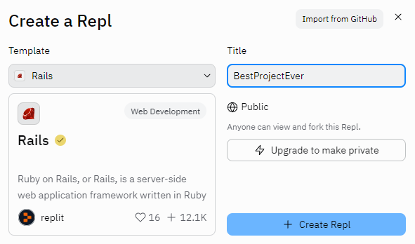

## Шаг 2. Создаём Git репозиторий на Replit

1. Находим во вкладке Tools инструмент Git
   
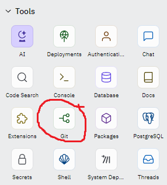

2. После выбора этого инструмента вылезет окно Git рядом с окном консоли, в нём нужно нажать `Initialize Git Repository`. Рекомендуется перед этим снять галочку `Create initial commit with all changes`, потому что этот коммит будет создан от лица вашего пользователя реплит а не от вашего аккаунта GitHub (Но если вы её не убрали, ничего пересоздавать не нужно, продолжайте следовать гайду)
   
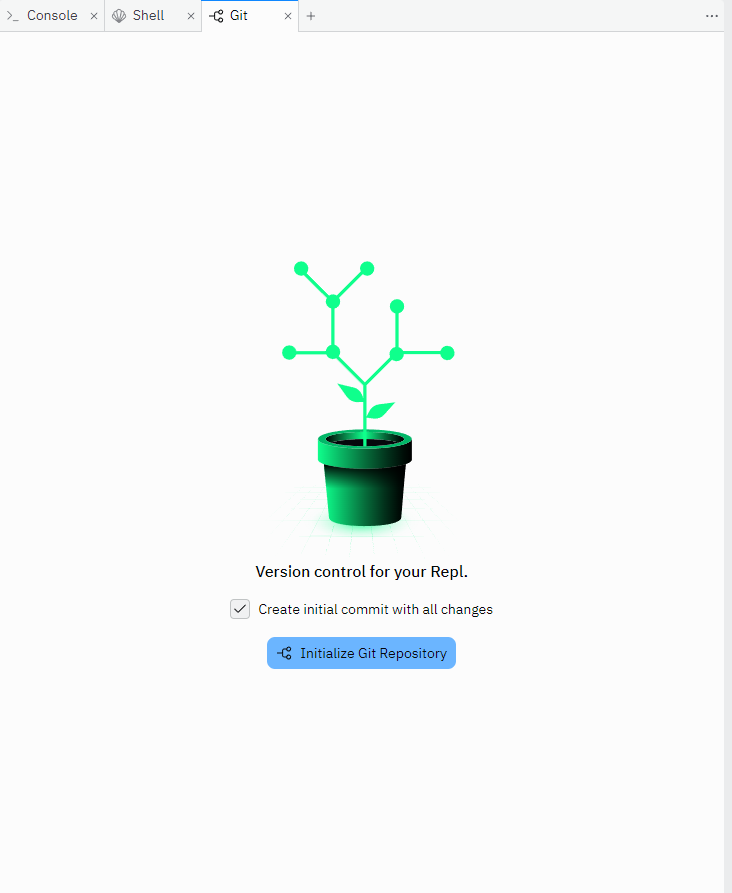

4. Теперь окно этого инструмента показывает ветки Git

## Шаг 3. Подключаем GitHub

1. Нажимаем на иконку настроек репозитория на Replit
   
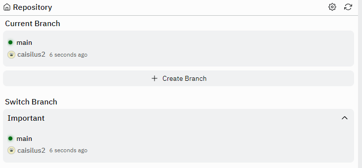

2. Нажимаем на первую кнопку `Connect to GitHub`
   
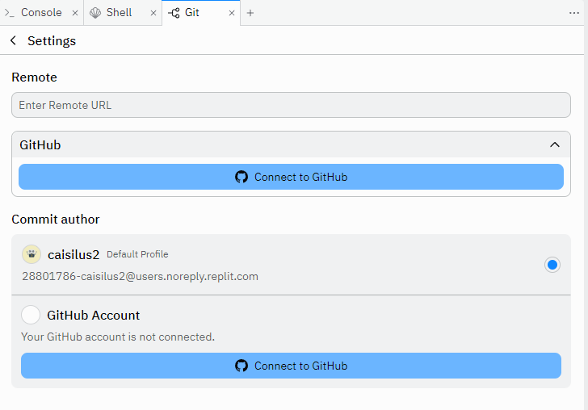

3. Вас перенаправит на GitHub, где нужно нажать `Install&Authorize.
   
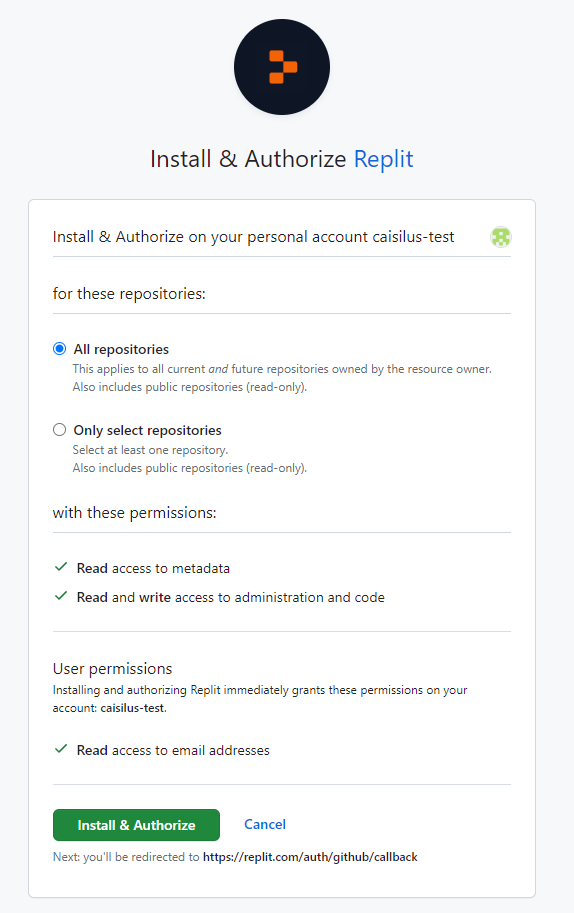

4. Вас перенаправит обратно на Replit, но на нём никаких изменений. Обновите страницу и снова перейдите в настройки репозитория Replit
5. Введите имя репозитория и описание и нажмите `Create Repository on GitHub`. В качестве `Commit author` рекомендуется выбрать ваш аккаунт GitHub вместо аккаунта Replit
   
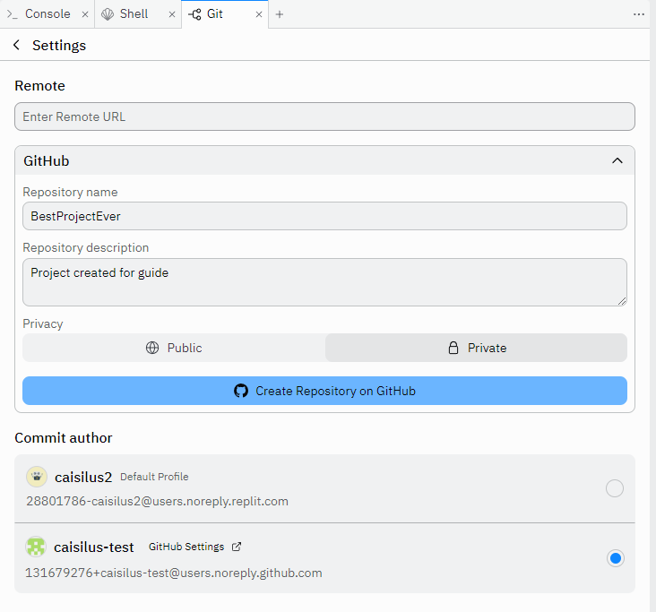

6. После того, как появится надпись, что репозиторий создан, вернитесь обратно из настроек репозитория к просмотру веток либо обновите страницу. Всплывет окно, в котором нужно нажать `Confirm for this session`
   
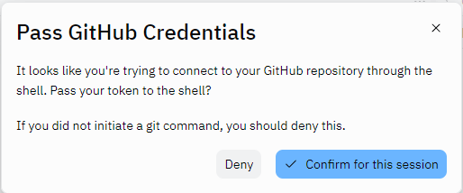

7. Если вы на шаге 2.2 не делали Initial Commit, то выберите в окне Git ветку main и сделайте ваш первый коммит в Replit.
8. Репозиторий на Github был создан, первый коммит сделан, но никаких файлов на GitHub пока нет. Выберите на Replit ветку main, и в ней нажмите `Publish branch as 'origin/main'`
   
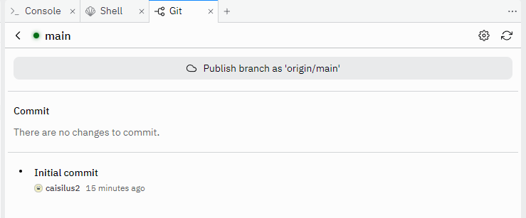

## Примечание

Если на шаге 2.2 вы не сняли галочку `Create initial commit with all changes`, в вашей истории коммитов на GitHub этот самый первый коммит будет от лица вашего пользователя Replit. Но пугаться этого не нужно, потому что все остальные коммиты Replit будет делать от лица того пользователя, которого вы выбрали на шаге 3.5

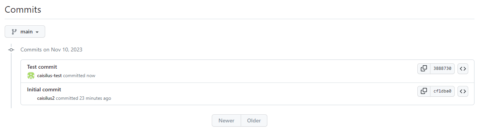

